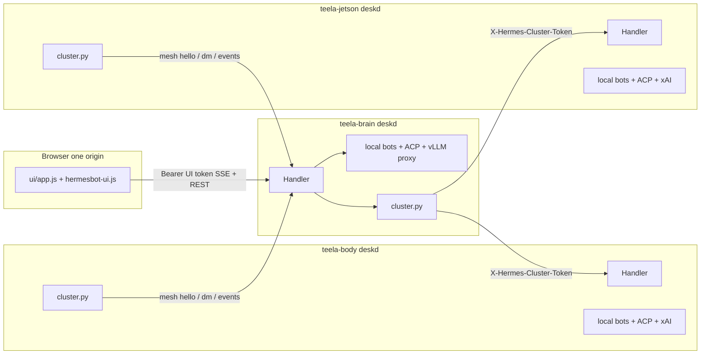
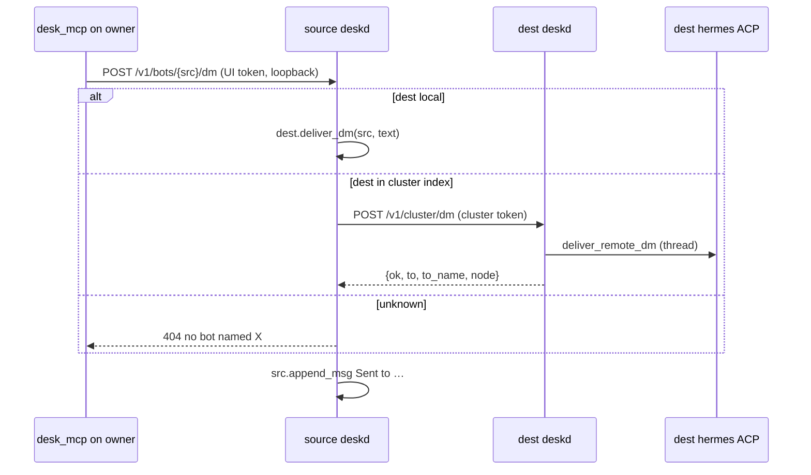
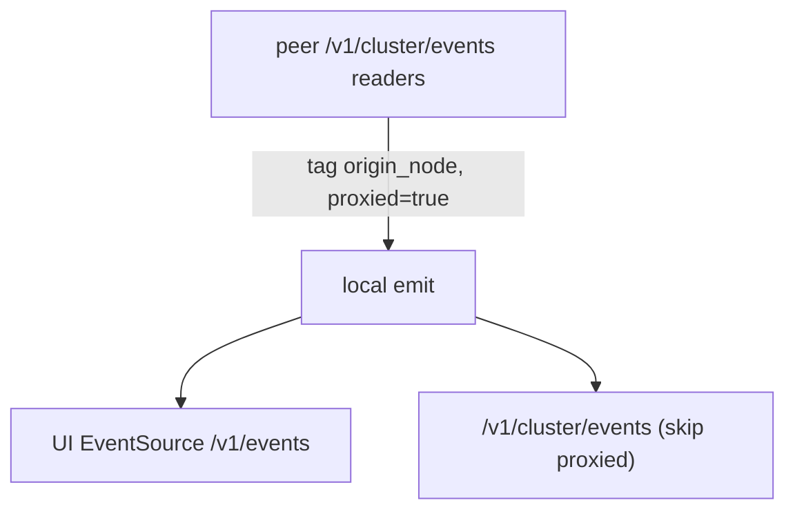

# Multi-host Hermes Desk LAN Federation

| Field | Value |
| --- | --- |
| **Title** | Multi-host Hermes Desk LAN federation |
| **Author** | Hermes Desk architecture |
| **Date** | 2026-08-30 |
| **Status** | Draft (rev 4 — open questions resolved) |
| **Codebase** | `/home/roni/hermes-desk` (not yet a git repo) |
| **Publish target** | GitHub `Colornosteela-cloud/Hermes-desk` |
| **Audience** | Senior engineers implementing immediately after consensus |

---

## Overview

Hermes Desk today is a single-process control plane: `deskd/deskd.py` owns an in-memory `bots` dict, serves the vanilla SPA from `ui/`, and is the ACP client for per-bot `hermes acp` children. `GET /v1/bots` lists only that process's bots. `POST /v1/bots/{id}/dm` resolves the destination in the same dict and calls `Bot.deliver_dm` in-process. The UI opens one `EventSource("/v1/events")` against one origin.

This design federates **three real LAN hosts** — `teela-brain` (10.0.0.10:8742, 2× Intel Arc Pro B60, local vLLM `qwen38`), `teela-body` (2× RTX 4060 Ti 16GB, likely Hermes 4.6 cloud), `teela-jetson` (Jetson Orin Nano Super, ARM, likely Hermes 4.6 cloud) — without a shared database, without GPU P2P, and without a cluster-wide model. Each host runs a full `hermes-deskd`. Bots, workspaces (`~/hermes-desks/<id>/workspace`), and `HERMES_DESK_HOME` (`~/.hermes/bots/<id>/hermes-home`) stay on the node that created them. Cognition stays per-bot / per-node.

The browser continues to talk to **one origin** (typically `http://10.0.0.10:8742`). That origin merges peer rosters, reverse-proxies bot-scoped HTTP (prompt, chats, workspace, browser frames, TUI/shell), fans peer SSE into the existing `/v1/events` stream, and forwards teammate DMs over a cluster-authenticated LAN protocol. Remote nodes are never contacted by the phone/desktop UI. Mesh **configuration** (token, peers) is loopback-only so a guest who obtained the LAN UI token via `/v1/bootstrap` cannot read or rotate the cluster secret.

---

## Background & Motivation

### Current state (code, not aspiration)

| Concern | Today | File / symbol |
| --- | --- | --- |
| Config | `~/.hermes/desk.json` is only `listen_host` / `listen_port` | `load_desk_config()` L123–139, live file `{"listen_host":"10.0.0.10","listen_port":8742}` |
| Config save | **Overwrites the whole file** with those two keys | `save_desk_config()` L142–145; `apply_listen()` L177–188 |
| Auth | Per-process UI token in `$XDG_RUNTIME_DIR/hermes-desk/token` | `desk_token()` L220–223; `_auth_ok()` L2692–2710 |
| LAN | Settings bind: loopback → `127.0.0.1`, else `0.0.0.0`; UI already works from phone | `bind_address()` L80–81, `lan_mode()` L84–85, `public_listen()` L167–174 |
| Bootstrap | Unauthenticated on loopback or LAN; returns UI token **and already includes `lan` via `public_listen()`** | `GET /v1/bootstrap` L2816–2822 + `public_listen()` L167–174 |
| Roster | Local `bots` dict only | `GET /v1/bots` L2851–2853 |
| DM | In-process `bots.get(spec)` / name match → `dest.deliver_dm(src, text)` | `do_POST` L3142–3161; `Bot.deliver_dm` L2128–2148 |
| SSE | In-process `subscribers` list; `emit()` fan-out | `emit()` L191–201; `Handler._sse()` L3006–3041; UI `connectEvents()` `ui/app.js` L2418 |
| emit overflow | If a subscriber queue exceeds 500, **that subscriber is disconnected** (not a cap-and-keep of old events) | `emit()` L198–201 |
| MCP teammates | `desk_mcp.py` GET `/v1/bots` + POST `/v1/bots/{BOT}/dm` against **loopback** `HERMES_DESK_URL` | `deskd/desk_mcp.py`; injected at `AcpClient._start_locked` L580–596 |
| Inference | Loopback-only `/v1/llm` → `127.0.0.1:8000`, alias map, `enable_thinking=false` | `_proxy_local_llm()` L2727–2795; `_auth_ok` rejects non-loopback L2696–2697 |
| Child models | `write_child_config()` rewrites `127.0.0.1:8000/8080` → `http://127.0.0.1:{LISTEN_PORT}/v1/llm`, idle 600s | L250–261, L264–319 |
| HTTP verbs | `do_GET` / `do_POST` / `do_PUT` / `do_DELETE` / `do_OPTIONS`. **No `do_PATCH`.** | `Handler` L2803–3472 |
| POST body | `do_POST` **always** `_read_json()` before routing, 80 MB cap | L3043–3056 |
| UI roster | No node badge; `renderRoster()` uses name+status only | `ui/app.js` L1059–1079; `renderAgentRail` `ui/hermesbot-ui.js` L1241 |
| Settings | Profile tab: listen host/port only; save posts those two keys | `ui/index.html` L529–531; `deskSaveAccess` `ui/app.js` L1736–1741; save handler `ui/hermesbot-ui.js` L1424–1439 |
| Create/delete | Always the process serving the request; modal defaults model to `qwen38-27b` | `create_bot()` L2651–2668; `do_DELETE` L3464–3471; `ui/index.html` L654–658; `hermesbot-ui.js` L1107, L1524 |
| Chrome binary | `HERMES_DESK_CHROME` default `~/.cache/ms-playwright/chromium-1234/chrome-linux64/chrome` (x86_64) | `surfaces.py` L26–29; `ensure_browser` swallows start failures `deskd.py` L1932–1942 |

Working features that this design **must not replace with mocks**: ACP stdio chat, per-bot `HERMES_DESK_HOME` / workspace, persistence (`chat.jsonl`, timeline, import/export), TUI + browser surfaces, local vLLM proxy, phone (≤760) / compact (≤1280) / desktop layouts, composer pill, context meter, LAN listen.

### Pain points

1. Cloning the tree onto `teela-body` or `teela-jetson` produces a **second isolated desk**. Opening brain's UI cannot see those bots.
2. Teammate MCP is local-only (`desk_mcp.py` L111–128). A brain bot cannot `message_teammate` a body bot.
3. Hardware is heterogeneous. Intel XPU vLLM on brain must not be tensor-paralleled with NVIDIA 4060 Ti or Jetson. Inference is not a cluster resource.
4. Phone-on-LAN hitting three origins would mean three UI tokens, CORS, and mixed EventSource connections. `_auth_ok` already special-cases static files and LAN bootstrap; multiplying origins would break that model.
5. `save_desk_config()` will silently destroy any cluster fields we add unless it starts preserving unknown keys. That is a blocker, not a follow-up.
6. LAN bootstrap already hands every Wi-Fi client the UI token. Cluster configuration that is writable with that same token is not a second authority.

### Target topology (this LAN)

```text
Phone / desktop browser
        │  one origin (typically) — roster/chat only; cannot edit mesh
        ▼
 teela-brain  10.0.0.10:8742     mesh config from 127.0.0.1 only
   2× Intel Arc Pro B60 (~24GB)
   vLLM qwen38  127.0.0.1:8000  TP=2  max-model-len 262144
   bots live in ~/.hermes/bots  workspaces in ~/hermes-desks
        │ cluster_token over LAN HTTP
        ├──────────────► teela-body    2× RTX 4060 Ti 16GB   (cloud Hermes 4.6 now; local NVIDIA later)
        └──────────────► teela-jetson  Orin Nano Super ARM   (cloud Hermes 4.6; no x86/XPU assumption)
```

---

## Goals & Non-Goals

### Goals

- One UI origin shows bots from all three nodes, with a node badge.
- Selecting a remote bot runs prompt / undo / model / soul / chats / workspace / browser / TUI / shell **on the owner node**.
- `list_teammates` / `message_teammate` work across nodes.
- SSE stays a single EventSource; origin fans in peer events.
- `~/.hermes/desk.json` grows `node_name`, `cluster_token`, `peers` without losing unknown keys on save.
- Cluster auth is a shared secret **distinct in string and in authority** from the per-desk UI token. Cluster routes refuse empty token. Mesh config is not writable with the UI token from the LAN.
- Clone/install docs for all three hardware profiles from the same repo.
- Latency on this 3-node LAN: roster merge **< 500ms** typical; DM **< 200ms** typical; SSE proxy must not add multi-second lag.
- Preserve extra `desk.json` fields on every save (listen, cluster, and any future keys). Empty password fields must not clear the token.

### Non-goals

- Shared database, CRDT, or replicated workspace disks.
- GPU P2P, Intel+NVIDIA tensor parallel, or a cluster-wide vLLM.
- Bouncing or shrinking brain's 262k local context.
- Hardware purchases (B70s) or a GPU scheduler.
- Browser talking to peer IPs (CORS / mixed auth).
- mDNS / DHCP hostname tracking (v1 is static URLs in `desk.json`).
- Multi-hop / transitive federation (A sees C only through B's peer list).
- WAN / TLS mesh. Assumption is RFC1918 LAN, but cluster_token is still mandatory.
- Putting tokens, API keys, GitHub PATs, or `auth.json` in the repo or this document's examples as real secrets.
- Replacing the stdlib `ThreadingHTTPServer` with Flask/FastAPI.
- A `do_PATCH` verb (none exists; do not add one for cluster).
- pytest or any new test runner (stdlib `unittest` only).
- Live dual-token cluster rotation (v1 is one shared `cluster_token`).
- Detecting `aarch64` / Jetson in code to disable `BrowserSurface` (docs set `HERMES_DESK_CHROME` only).

---

## Key Decisions

1. **Federation, not a single control plane.** Each host is a full deskd. Ownership is "created-on this node." Rationale: workspaces, Chromium profiles, ACP children, and GPU/cloud keys are already per-process and per-`HERMES_DESK_HOME`. A shared DB would still need remote execution.

2. **UI talks to one origin; deskd proxies.** Rationale: `_auth_ok` + `/v1/bootstrap` already mint a per-node UI token; phones already use `http://10.0.0.10:8742`. Extra EventSources against body/jetson would need those nodes' tokens and would fail CORS/mixed-content on some clients. The Cluster settings tab mutates **this origin's `desk.json` only**; body and jetson need the same tab (or a file edit) on those hosts.

3. **Two tokens, two authorities.** UI Bearer (`TOKEN_PATH`) for the browser and local MCP. `cluster_token` in `desk.json` for peer HTTP. `/v1/bootstrap` is reachable without a Bearer on LAN (`_auth_ok` L2698–2702) and **returns the UI token**, so the UI token is a LAN-guest credential. Therefore: never return `cluster_token` on any GET; writes of `cluster_token` / `peers` / `node_name` are **loopback-only**; rotation of a non-empty token also requires `cluster_token_confirm` equal to the current secret. Phones keep the merged roster; they do not reconfigure the mesh.

4. **Split roster APIs, with a defense-in-depth GET.** `GET /v1/bots` **with UI Bearer** = local ∪ peers (the merge). `GET /v1/cluster/bots` (cluster) = **local only**. `GET /v1/bots` **with cluster auth** also returns **local slim only** (same as `/v1/cluster/bots`) — never merge. Rationale: a one-line mistake in `fetch_remote_rosters` calling `/v1/bots` must not recurse. `POST /v1/bots` (create) is the exception cluster may call, because origin `/v1/cluster/create` forwards it.

5. **Cluster SSE is local `emit()` only.** Fan-in on the origin must not re-export remote events on `/v1/cluster/events`. Rationale: full-mesh of three nodes would otherwise loop forever.

6. **Generic bot-scoped reverse proxy**, not a hand-written RPC per route. A single `_proxy_or_local(path)` runs at the top of GET/POST/PUT/DELETE after `_authorize`. If the owner is remote, POST/PUT **must not** `_read_json()`; stream `rfile` with Content-Length. Rationale: `do_POST` today always reads JSON first (L3049–3056); `do_PUT` 404s before reading the body (L3431–3436). There is no `do_PATCH`.

7. **Create is local by default; delete/model/soul/prompt of a remote bot is proxied.** **Create-on-node is in this MVP** (PR-4 `/v1/cluster/create` + `peer-models`; PR-7 Home node picker). When home node ≠ this `node_name`, the model `<select>` is filled from **that peer's** `GET /v1/models`, defaulting to `hermes-4.6` for body/jetson, and create fails closed if the chosen id is not on the owner. MCP `create_teammate` stays owner-local and keeps using the calling node's default (often `qwen38-27b` on brain).

8. **New module `deskd/cluster.py` with no `deskd` imports.** `Handler` stays in `deskd.py`. Inject `emit`, `lookup_local_bot`, `local_profiles` from `main()`. `accept_dm` is handled in `Handler` (cluster.py only does outbound HTTP). Rationale: `deskd.py` is 3554 lines and a circular import would fail or partially initialize.

9. **No new Python dependencies.** Use existing `http.client.HTTPConnection` (already used by `_proxy_local_llm`) plus `threading`, `hmac.compare_digest`, `json`, stdlib `unittest`. Rationale: Jetson and both x86 boxes stay `python3 deskd/deskd.py`. Tests patch `desk_config_path()` / `HERMES_DESK_HOME`, not a phantom pytest.

10. **Hardware profiles are docs + example `desk.json` / `config.toml`, not code.** Rationale: inference is already per-child via `write_child_config` and `copy_auth`. A scheduler would imply shared GPUs, which we refuse. Jetson Chromium: **document `HERMES_DESK_CHROME` only**. Do not detect `aarch64` and skip `ensure_browser` / `BrowserSurface`.

11. **`save_desk_config` becomes merge-in-place** before any cluster keys land. Rationale: `apply_listen()` currently nukes the file. Empty `cluster_token` in a POST is ignored unless `cluster_token_clear: true`.

12. **MCP stays loopback to the owner deskd.** Cross-node teammates appear because `GET /v1/bots` on the owner merges (UI/MCP token), and `POST /v1/bots/{id}/dm` on the owner forwards. Rationale: `HERMES_DESK_URL` is already `http://127.0.0.1:{port}` with the **local** UI token; children must not learn peer URLs or the cluster secret.

13. **Fix MCP port to `LISTEN_PORT`.** Today `AcpClient._start_locked` injects `HERMES_DESK_URL=http://127.0.0.1:{DESK_PORT}` (env default, L581), not `LISTEN_PORT`. If settings change the port, desk_team/browser MCP miss deskd. Federation makes that footgun louder.

14. **GitHub repo contains no secrets.** `desk.json`, `auth.json`, runtime tokens, and any PAT stay on disk outside the tree. Examples use placeholders.

15. **Path-prefix `_authorize(path)` — never a global `_auth_ok() or _cluster_ok()`.** Roles are `public | ui | ui_local | cluster | deny`. `/v1/llm*` stays loopback regardless of cluster header. `/v1/settings` and `/v1/bootstrap` deny cluster. `/v1/cluster/*` (except the UI-token origin helpers listed below) deny UI Bearer. Mesh-config writes (`token-new`, POST settings cluster keys) require **`ui_local`** (`_ui_ok()` and loopback) inside `_authorize` / `_require_loopback()`, not a later Handler comment. Reverse mesh check is `GET /v1/cluster/links` (cluster bucket) over the callee’s own `peers[]` — never a caller-supplied URL. These deny tests live in **PR-2**, not a later hardening PR.

16. **`Cluster.index` is maintained continuously**, not only on roster GET: upsert on `/v1/cluster/bots` and `/v1/cluster/create`; fan-in `bot.created`/`bot.updated` (proxied) writes `index[id]=origin_node`; `bot.deleted` drops the id; `owner()` miss does one cheap refresh then 404.

17. **UI roster merge-by-id is mandatory.** `refreshBots()` must not `state.bots = j.bots`. Server `GET /v1/bots` omits `messages` on every list entry (local and remote). `GET /v1/bots/{id}` still returns the full profile including messages.

18. **`cluster_token` is not a Hermes/xAI API key.** Three secrets stay distinct: (a) UI Bearer in `$XDG_RUNTIME_DIR/hermes-desk/token`, (b) mesh `cluster_token` in `desk.json` (deskd↔deskd on the LAN), (c) per-host xAI/cloud credentials in that node's `~/.hermes/auth.json` **shared** into each bot's `HERMES_HOME` (symlinked `auth.json`; never a byte copy — that forks the OIDC refresh token and forces `/login` after sleep). Body and jetson bots typically **think** with Hermes 4.6 cloud on *that* host's keys; brain bots may stay on local vLLM `qwen38`. Cross-node DM/proxy/SSE still needs `cluster_token` even when the remote bot has no local GPU model — brain (local qwen) messages a body bot, body answers with cloud Hermes 4.6 on body. Do **not** drop mesh auth because “non-brain nodes use cloud tokens.” Do **not** implement live dual-token cluster rotation; v1 is one shared `cluster_token`, rotated from each host's localhost when needed.

---

## Proposed Design

### 1. Process architecture



Each node also lists the other two as peers so opening the UI against body or jetson still shows the full hallway. Configuring those peer lists happens **on each host**, typically from `127.0.0.1` (SSH tunnel or a browser on that box).

### 2. Config (`~/.hermes/desk.json`)

Current live file:

```json
{
  "listen_host": "10.0.0.10",
  "listen_port": 8742
}
```

Target shape (placeholders — **not** real IPs or secrets). Brain listen stays `10.0.0.10:8742`. Body/jetson URLs in git examples are `http://10.0.0.xx:8742` / `http://10.0.0.yy:8742`; **fill real RFC1918 literals at install on each host**. No hostnames in v1.

```json
{
  "listen_host": "10.0.0.10",
  "listen_port": 8742,
  "node_name": "teela-brain",
  "cluster_token": "<shared 32+ byte urlsafe secret>",
  "peers": [
    {"name": "teela-body", "url": "http://10.0.0.xx:8742"},
    {"name": "teela-jetson", "url": "http://10.0.0.yy:8742"}
  ]
}
```

Rules:

- `node_name`: hostname-like, 1–64 chars `[A-Za-z0-9._-]`. Default `socket.gethostname()`. Shown on roster badges. Not required unique at write time (the other node is not reachable as a lock); **self-test warns** if two hellos return the same `node` or if a peer's hello.`node` ≠ configured `peers[].name`.
- `cluster_token`: generated with `secrets.token_urlsafe(32)` from Settings (loopback). Empty ⇒ cluster routes return 403 and peer fetch is skipped. Same value on all three nodes.
- `peers[]`: `name` + `url`. Max 8 peers (we have 3).
- `peers[].url` validation (reject the POST, do not coerce):
  - scheme `http` only (no https, no file, no ws)
  - no userinfo
  - host must be an **IPv4 literal** in RFC1918 (`10.0.0.0/8`, `172.16.0.0/12`, `192.168.0.0/16`) or loopback `127.0.0.0/8` (for dual-process tests)
  - **deny** link-local `169.254.0.0/16`, metadata IPs, IPv6, hostnames in v1 (no surprise DNS, no IMDS)
  - optional port 1–65535; default 8742; strip path and trailing `/`
  - **reject self-peer**: host:port equal to this process's `access_host():LISTEN_PORT` or `127.0.0.1:LISTEN_PORT` when we are bound to that port
- Unknown keys are retained forever.

#### Config API in `deskd.py`

Replace the two-key helpers. Seam for tests is `desk_config_path()` (already L71–72), not the `DESK_CONFIG_PATH` global:

```python
def desk_config_path() -> Path:
    return USER_AGENT_HOME / "desk.json"   # already exists; tests patch this or HERMES_DESK_HOME

def read_desk_file() -> dict[str, Any]:
    """Raw JSON object, or {} if missing/corrupt. Never throws for callers."""

def load_desk_config() -> dict[str, Any]:
    """listen_host/listen_port plus node_name, cluster_token, peers, extras."""

def write_desk_file(data: dict[str, Any]) -> None:
    """Atomic replace (temp + os.replace). Preserves unspecified keys by
    requiring callers to pass the merged dict."""

def patch_desk_config(patch: dict[str, Any]) -> dict[str, Any]:
    """Read-merge-write. Used by apply_listen and POST /v1/settings.
    Empty-string cluster_token is NOT applied unless cluster_token_clear.
    Omitted keys are left unchanged."""

def save_desk_config(host: str, port: int) -> None:
    """Back-compat wrapper: patch_desk_config({listen_host, listen_port})."""
```

`apply_listen()` (L177) must call `patch_desk_config`, not the current two-key dump. Listen-only patches must not mention cluster keys at all.

#### `POST /v1/settings` patch semantics

Today only reads `listen_host`/`listen_port` (L3058–3061). Extend:

| Body field | Who may set | Semantics |
| --- | --- | --- |
| `listen_host` / `listen_port` | UI Bearer, any client | existing `apply_listen` (may rebind) |
| `node_name` | UI Bearer **and** loopback | identity; ignored if omitted |
| `cluster_token` | UI Bearer **and** loopback | ignored if missing or `""`; applied only if non-empty. If a token is **already** set, also require `cluster_token_confirm` equal to the current secret (`hmac.compare_digest`) |
| `cluster_token_clear: true` | UI Bearer **and** loopback | the only way to empty the token; still requires `cluster_token_confirm` if one is set |
| `peers` | UI Bearer **and** loopback | replace the list only when the key is present **and** the Cluster tab actually loaded (`peers_loaded: true` from the UI). An omitted `peers` key leaves disk unchanged. `peers: []` with `peers_loaded: true` is a deliberate clear (rollback) |

Non-loopback POST that includes **any** cluster-config key (`node_name`, `cluster_token`, `cluster_token_confirm`, `cluster_token_clear`, `peers`, `peers_loaded`) → **403** `{error: "cluster config is local-only"}` and **apply nothing** (no listen rebind, no disk write). Listen-only POSTs from the phone (those keys absent) stay 200. The UI must omit cluster keys off-loopback (already the save rule); the 403 is a server backstop, not a partial commit. Changing listen on an allowed POST must not drop cluster keys; changing cluster must not drop listen.

After a successful cluster patch: refresh the in-memory `Cluster` (rebuild peers, restart fan-in). After listen rebind (`_rebind_http`): restart fan-in so hello advertisements and inbound peer SSE resubscribe; outbound readers also recycle.

#### `GET /v1/settings`

Currently returns only `public_listen()` (L2823–2824). Add `node_name`, `cluster_token_set: bool`, and `peers` as `{name, url, status, latency_ms}` (needed for the home-node dropdown and the Cluster tab's read-only status on a phone).

**Never return `cluster_token`.** The password field is write-only. Generate happens client-side (`secrets` via `POST /v1/cluster/token-new` loopback-only, which returns the new value **once** in that POST response, or the UI generates urlsafe in JS and POSTs it). Prefer server `POST /v1/cluster/token-new` (loopback + UI) so the token is not born in DevTools-friendly JS; the response body is the only time the secret is sent to a client, and only to 127.0.0.1.

#### `GET /v1/bootstrap`

Already returns `token`, `port`, and `public_listen()` including `lan`, `listen_host`, `listen_port`, `access_url`. Add `node_name` only. Must **not** grow `cluster_token`, `cluster_token_set`, or `peers`. Cluster header on this path is **deny** (would leak the UI token to a peer).

### 3. Auth — path-prefix `_authorize`, not `_auth_any()`

Do **not** add `_auth_any()` as `_auth_ok() or _cluster_ok()`. Handler today gates every verb with a single `if not self._auth_ok(): 401` at the top of `do_GET`/`do_POST`/`do_PUT`/`do_DELETE`. Replace that with one decision function that returns a role:

```python
# deskd.py — sketch; tests in PR-2 lock this table
UI_CLUSTER_HELPERS = {          # UI Bearer, any client (phone OK)
    "/v1/cluster/self-test",
    "/v1/cluster/create",
    "/v1/cluster/peer-models",
}
UI_LOCAL_ONLY = {               # UI Bearer AND loopback
    "/v1/cluster/token-new",
}
CLUSTER_KEYS = (
    "node_name", "cluster_token", "cluster_token_confirm",
    "cluster_token_clear", "peers", "peers_loaded",
)

def _is_loopback(self) -> bool:
    return self.client_address[0] in ("127.0.0.1", "::1")

def _require_loopback(self, role: str) -> bool:
    """True iff this request may mutate mesh config. Used by POST /v1/settings
    and asserted in PR-2; not a comment-only afterthought."""
    return role == "ui_local"

def _ui_role(self) -> str:
    if not self._ui_ok():
        return "deny"
    return "ui_local" if self._is_loopback() else "ui"

def _authorize(self) -> str:
    """Return 'public' | 'ui' | 'ui_local' | 'cluster' | 'deny'. Never OR secrets."""
    path = urlparse(self.path).path
    if path in ("/", "/index.html", "/app.js", "/styles.css", "/hermesbot.css",
                "/hermesbot-ui.js") or path.startswith(("/ui/", "/assets/", "/vendor/")):
        return "public"
    if path.startswith("/v1/llm"):
        # loopback only — cluster header does not count
        return "public" if self._is_loopback() else "deny"
    if path == "/v1/bootstrap":
        if self._cluster_header_present():
            return "deny"
        if self._is_loopback() or lan_mode():
            return "public"
        return "deny"
    if path in UI_LOCAL_ONLY:
        return "ui_local" if self._ui_ok() and self._is_loopback() else "deny"
    if path == "/v1/settings" or path in UI_CLUSTER_HELPERS:
        return self._ui_role()   # cluster header insufficient; settings GET allows ui
    if path.startswith("/v1/cluster/"):
        return "cluster" if self._cluster_ok() else "deny"  # UI Bearer insufficient
    if path == "/v1/events":
        return self._ui_role() if self._ui_ok() else "deny"
    # /v1/bots, /v1/bots/…, /v1/agent/…, /v1/workspaces/…, /v1/control/…, /v1/models
    if self._ui_ok():
        return self._ui_role()
    if self._cluster_ok():
        return "cluster"
    return "deny"
```

Then `do_*`: `role = self._authorize(); if role == "deny": return self._json(401, {"error": "unauthorized"})`.

`POST /v1/settings`: if `any(k in body for k in CLUSTER_KEYS)` and not `_require_loopback(role)` → **403, apply nothing**. Listen-only bodies (`CLUSTER_KEYS` absent) from a phone (`role == "ui"`) still 200.

`_ui_ok()` is today's Bearer / `?token=` compare (`hmac.compare_digest`). `_cluster_ok()` compares `X-Hermes-Cluster-Token` or `Authorization: Cluster <token>` the same way, and is false when the configured token is empty. `_cluster_header_present()` is true if either header looks like a cluster attempt, used to refuse bootstrap even with a wrong token.

| Path | UI Bearer / `?token=` | Cluster header | Unauthenticated |
| --- | --- | --- | --- |
| Static UI (`/`, `/app.js`, `/vendor/…`) | n/a (already open) | n/a | yes |
| `GET /v1/bootstrap` | n/a | **deny** (would leak UI token) | loopback or `lan_mode()` as today |
| `/v1/llm*` | loopback only, **regardless of headers** | **deny** (peer IP is not loopback) | loopback only |
| `GET /v1/settings` | `ui` or `ui_local` | **deny** | no |
| `POST /v1/settings` listen-only | `ui` or `ui_local` | **deny** | no |
| `POST /v1/settings` with any cluster key | **`ui_local` only**; else 403 apply-nothing | **deny** | no |
| `/v1/events` | yes | deny (use `/v1/cluster/events`) | no |
| `GET /v1/bots` | **merge** | **local slim only** (no merge) | no |
| `POST /v1/bots` (create) | local create | **allowed** (owner create from origin `/v1/cluster/create`) | no |
| `/v1/bots/{id}…`, `/v1/agent/…`, `/v1/workspaces/…`, `/v1/control/…`, `GET /v1/models` | yes | yes, if token configured | no |
| `/v1/cluster/hello`, `/bots`, `/events`, `/dm`, **`/links`** | **deny** | yes | no |
| `/v1/cluster/self-test`, `/create`, `/peer-models` | yes (`ui` or `ui_local`) | **deny** | no |
| `/v1/cluster/token-new` | **`ui_local` only** | **deny** | no |

Cluster header (one of):

- `X-Hermes-Cluster-Token: <token>`
- `Authorization: Cluster <token>`

Compare with `hmac.compare_digest` after encoding both as UTF-8. Reject if configured token is empty. Never log the header or query `token=`; strip query strings in `Handler.log_message` (today L2688–2690 prints the raw request line, which includes `/v1/events?token=`).

Local MCP continues to use the UI token (loopback). Peers never receive another node's UI token.

This table is **tested in PR-2** with a fake peer: cluster header on `/v1/llm`, `/v1/settings`, `/v1/bootstrap` → 401/403; UI Bearer on `/v1/cluster/hello` and `/v1/cluster/links` → 401; empty token → 403 on `/v1/cluster/*`; GET `/v1/bots` with cluster → body has no peer-merged ids. **Loopback gate (PR-2, not a Handler comment):** UI Bearer from a non-loopback IP (`10.0.0.50`) POST `/v1/settings` `{peers: [...]}` or `{cluster_token: "x"}` → 403, `desk.json` bytes unchanged (listen not applied either); same POST from `127.0.0.1` with `cluster_token_confirm` when a token is already set → 200; `POST /v1/cluster/token-new` from a non-loopback IP → 403. **Links SSRF:** `GET /v1/cluster/links?url=http://169.254.169.254/` is treated exactly as `GET /v1/cluster/links` (query ignored); the callee never opens a connection to a host that is not already in its `desk.json` `peers[]`.

### 4. `deskd/cluster.py`

No `import` of `deskd` / `deskd.py` names. Constructed in `main()` after `load_desk_config()` with injected callbacks:

```python
@dataclass
class Peer:
    name: str
    url: str          # origin, no trailing slash
    status: str       # "ok" | "offline" | "auth" | "unconfigured" | "name_mismatch"
    last_err: str
    last_hello_ms: float
    latency_ms: float | None
    hello_node: str   # from last hello, may differ from configured name

class Cluster:
    def __init__(
        self,
        *,
        emit: Callable[[dict], None],
        lookup_local_bot: Callable[[str], Any | None],
        local_profiles: Callable[[], list[dict]],
        is_local_id: Callable[[str], bool],
    ) -> None: ...
    node_name: str
    token: str
    peers: list[Peer]
    index: dict[str, str]          # bot_id -> peer.name
    roster_cache: dict[str, list]  # peer.name -> slim bots
```

`main()`:

```python
cluster = Cluster(
    emit=emit,
    lookup_local_bot=lambda spec: bots.get(spec) or next(
        (b for b in bots.values() if b.name.lower() == spec.lower()), None),
    local_profiles=lambda: [b.profile() for b in bots.values()],
    is_local_id=lambda bid: bid in bots,
)
```

Public functions (HTTP only in this module; no `Bot.deliver_*`):

| Function | Role |
| --- | --- |
| `annotate_local(profile) -> dict` | Adds `node`, `remote: false`, `node_status: "ok"`; **strips `messages`** for list payloads |
| `slim(profile) -> dict` | id, name, description, avatar, model, models, status, surface, control, context_used, context_window, workspace_id, can_undo, chat_id, chat, node, remote, node_status — **never `messages`, never absolute `workspace`** |
| `merged_roster() -> list[dict]` | UI path: local slim + remote slim, parallel fetch |
| `local_roster() -> list[dict]` | Cluster path: local slim only |
| `owner(bot_id) -> "local" \| Peer \| None` | Index lookup with miss-refresh |
| `proxy(handler, peer, timeout)` | Streaming reverse proxy; reads `handler.rfile` itself |
| `forward_dm(payload) -> dict` | POST `/v1/cluster/dm` to owner (HTTP) |
| `create_on_peer(peer, body) -> dict` | POST `/v1/bots` on peer with cluster token; upsert index from response |
| `peer_models(peer) -> dict` | GET `/v1/models` on peer with cluster token |
| `hello_payload() -> dict` | Identity + `peer_names` (configured names only, no URLs) |
| `list_links() -> dict` | Hello **this node's** `peers[]` only; ignore query/body; never fetch a host not in `desk.json` |
| `start_fanin()` / `stop_fanin()` | Per-peer SSE threads → injected `emit()` |

`Handler` owns `POST /v1/cluster/dm`: parse body, `lookup_local_bot(to)`, `bot.deliver_remote_dm(...)`, return JSON. cluster.py does not call `deliver_dm`.

#### Index maintenance (required for PR-4)

```text
upsert index[id] = peer.name
  • every successful GET /v1/cluster/bots row
  • POST /v1/cluster/create response bot.id
  • fan-in event type bot.created | bot.updated with proxied=true
      → index[event.bot.id or event.bot_id] = event.origin_node
drop
  • fan-in bot.deleted → index.pop(bot_id, None)
  • local destroy does not touch index (id was never remote)
```

`owner(bot_id)`:

1. If `is_local_id(bot_id)` → `"local"`.
2. If `bot_id in index` → that `Peer` (even if `status == "offline"`; caller returns 503 on mutate).
3. Else: one `fetch_remote_rosters(timeout=0.35)` (do not hold `lock` around `bots` during HTTP).
4. If now in index → that Peer; else `None` → 404 `{error: "not found", retry: false}`.

Do not leave a live-but-unindexed bot: a jetson-side create must either fan-in `bot.created` (step 3) or be picked up by the next roster merge. `selectBot` before the index upsert is the miss-refresh path.

#### Roster merge (`GET /v1/bots`)

Today (L2851–2853):

```python
with lock:
    return self._json(200, {"bots": [b.profile() for b in bots.values()]})
```

New:

```python
if role == "cluster":
    with lock:
        return self._json(200, {
            "node": cluster.node_name,
            "bots": [cluster.slim(cluster.annotate_local(b.profile())) for b in bots.values()],
        })
# UI Bearer: merge. Never include messages on list entries.
with lock:
    local = [cluster.slim(cluster.annotate_local(b.profile())) for b in bots.values()]
remote, diagnostics = cluster.fetch_remote_rosters(timeout=0.35)
return self._json(200, {
    "bots": cluster.merge(local, remote),   # local wins on id collision
    "node": cluster.node_name,
    "peers": diagnostics,   # [{name, url, status, latency_ms, hello_node}]
})
```

Fetch strategy:

- One thread per peer (3 nodes ⇒ 2 threads).
- `HTTPConnection` timeout **0.35s** connect+read for roster (budget: merge < 500ms typical; LAN RTT is tens of ms).
- Peer **must** be called at `GET /v1/cluster/bots`, never `GET /v1/bots`.
- ID collision: local wins; drop remote duplicate; include `peers[].warning`. 12-hex ids (`bot_id()` L204–205) are 48 bits; still handle it.
- Peer timeout: serve last-good `roster_cache` with `node_status: "offline"` so the hallway does not empty when jetson naps. Mutating a stale remote bot returns 503 `peer offline`. **PR-3 owns this cache**; it is not a PR-9 leftover.

`GET /v1/bots/{id}` (UI or cluster) returns the **full** `Bot.profile()` including `messages` (proxied if remote). Absolute `workspace` stays on the owner GET only.

#### Client merge-by-id (mandatory, PR-3/PR-7)

`refreshBots()` today (`ui/app.js` L1081–1083) does `state.bots = j.bots || []`, which would wipe `messages` the moment a slim list arrives — including after `deskCreateBot` (L1721) while a remote chat is selected. Replace with:

```javascript
function mergeBot(prev, incoming) {
  const next = { ...(prev || {}), ...incoming };
  if (!Object.prototype.hasOwnProperty.call(incoming, "messages") && prev?.messages) {
    next.messages = prev.messages;
  }
  return next;
}
async function refreshBots() {
  const j = await api("/v1/bots");
  const incoming = j.bots || [];
  const prevById = Object.fromEntries((state.bots || []).map((b) => [b.id, b]));
  state.bots = incoming.map((b) => mergeBot(prevById[b.id], b));
  // drop ids no longer present
  renderRoster();
  if (state.selected) {
    const b = state.bots.find((x) => x.id === state.selected);
    if (b) renderConversation(b);
  }
}
```

`connectEvents` `bot.created` / `bot.updated` must use the same `mergeBot` (peer `profile()` may include `messages`; that is a fill, not a wipe). Fan-in of a **new** id without messages leaves `messages` undefined until `selectBot` GETs the full profile — do not render an empty transcript for a bot that was not selected.

### 5. Cluster HTTP surface

`/v1/cluster/hello|bots|events|dm|links` require role `cluster`. If `cluster_token` is empty, 403 `cluster not configured`.

UI helpers (`self-test`, `create`, `peer-models`) require role `ui` or `ui_local`. `token-new` requires **`ui_local`** (deny from `_authorize`, not a later check). Any settings write of token/peers requires `_require_loopback(role)`.

#### `GET /v1/cluster/hello`

```json
{
  "node": "teela-body",
  "listen_host": "10.0.0.xx",
  "listen_port": 8742,
  "version": "0.1.0",
  "bots": 2,
  "peer_names": ["teela-brain", "teela-jetson"]
}
```

`peer_names` is the configured `peers[].name` list **only** (no URLs). Reverse *config* is “is our `node_name` in that list”. Do **not** accept a caller-supplied URL and do **not** ask the peer to GET us — that is SSRF.

#### `GET /v1/cluster/links` (cluster auth)

Hellos **the callee’s own `desk.json` `peers[]`**. No body. Query string is **ignored** (`?url=` is not a fetch target). Never opens a connection to a host that is not already in `peers[]`.

```json
{
  "node": "teela-body",
  "links": [
    {"name": "teela-brain", "status": "ok", "latency_ms": 12, "hello_node": "teela-brain"},
    {"name": "teela-jetson", "status": "offline", "latency_ms": null, "hello_node": null}
  ]
}
```

Each row is `GET {that peer}/v1/cluster/hello` with the callee’s cluster token, 0.35s timeout, RFC1918 URL already validated at settings-write time. `_authorize` bucket: **cluster** (not a UI helper). Origin self-test then `GET {body}/v1/cluster/links` and looks up `teela-brain` in `links[]`.

Used by Settings "test peer" and by fan-in reconnect (hello only; links is diagnostic).

#### `GET /v1/cluster/bots`

```json
{
  "node": "teela-body",
  "bots": [ { "id": "b_…", "name": "…", "remote": false, "node": "teela-body", …slim } ]
}
```

Local slim only, **no** peer fetch.

#### `GET /v1/cluster/events`

SSE, same framing as `Handler._sse()` (L3006–3041): `:ok`, `data: {json}\n\n`, `:keepalive` every 15s.

Subscribe to local `subscribers` (the same `emit()` bus). **Do not** enqueue events that originated from fan-in. Implementation: `emit(event)` gains `event.setdefault("origin_node", NODE_NAME)`. Fan-in sets `origin_node` to the peer and `proxied: true`. Cluster SSE skips `proxied is True`.

There is **no last-event-id / replay**. `emit()` does not cap-and-keep: if `len(q) > 500` the **subscriber is dropped** (L198–201). A slow UI EventSource is disconnected, not given a truncated buffer. Fan-in reconnect (0.5s–8s) therefore misses in-flight `session.update` chunks. Mitigation in §8.

#### `POST /v1/cluster/dm`

```json
{
  "from_id": "b_aaa",
  "from_name": "teela-brain",
  "from_node": "teela-brain",
  "to": "b_bbb",
  "text": "please take the motor homing job"
}
```

Handler (not cluster.py):

1. Resolve `to` by id, else case-insensitive name, in **local** `bots` only.
2. 404 if missing (do not hop).
3. `Bot.deliver_remote_dm(from_id, from_name, from_node, text)` — same as `deliver_dm` (L2128) but the sender is not a local `Bot` instance.
4. Return 200 immediately after inbox append + `emit` + ACP thread start (same as today: `_run` is already a daemon thread L2139–2148).

Inbox jsonl grows `from_node`. Chat bubble text: `✉️ teela-brain@teela-brain: …`. `via="dm"` unchanged so `ui/app.js` L1152–1156 keeps the existing "from {peer}" tag.

#### `POST /v1/cluster/create` (UI Bearer, origin)

Body: `{ "peer": "teela-jetson", "name": "...", "description": "...", "soul": "...", "model": "hermes-4.6" }`.

Origin looks up peer by name, `cluster.create_on_peer` → `POST {peer}/v1/bots` with cluster token (allowed; see matrix). Fail closed if peer offline or if `model` is not in that peer's `GET /v1/models`. Upsert `index[bot.id] = peer.name` from the response. Implemented in **PR-4**.

#### `GET /v1/cluster/peer-models?peer=` (UI Bearer, origin)

Fetches that peer's `GET /v1/models` with cluster token. Used when the create-modal Home node ≠ this node.

#### `POST /v1/cluster/token-new` (UI Bearer **and** loopback)

Returns `{ "cluster_token": "<new>" }` once. Does not persist until Settings save POSTs it (with confirm if replacing). Never logged.

#### `POST /v1/cluster/self-test` (UI Bearer)

Origin only walks **this host’s** `peers[]` (same no-SSRF rule). For each peer:

1. `GET {peer}/v1/cluster/hello` → `forward` (`ok` / `offline` / `auth`), `hello_node`, `peer_names`. Reverse *config*: `reverse_config = node_name in hello.peer_names` (`missing_peer` if false).
2. If forward is `ok`: `GET {peer}/v1/cluster/links` (cluster token, **no URL in query/body**) → look up this origin’s `node_name` in `links[]` → `reverse` (`ok` / `offline` / `auth`). If forward failed, skip links and set `reverse: "skipped"`.

Reports `{name, url, latency_ms, hello_node, forward, reverse, reverse_config}`. Warn when `hello_node` ≠ configured name. Does not print the token. Never asks a peer to fetch an origin-supplied URL.

### 6. DM path (local + remote)

Today (`do_POST` L3142–3161): look up dest in `bots`; `deliver_dm`; also append "Sent to …" on src.

New:



UI-originated DMs do not exist today (only MCP). After merge, a body bot listed on brain will be a valid `to` for a brain bot's `message_teammate`. `desk_mcp.py` does not change its HTTP paths; it automatically benefits.

Name clashes across nodes (`two bots named "research"`): resolve **local first**, then the first remote match in **`peers[]` order** (documented, not a search). Return `to_node` so the sender can disambiguate. Prefer id. Tool description in `TOOLS` must say: "Pass bot id; names may collide across nodes and resolve local-first then peers-list order."

### 7. Bot-scoped reverse proxy

`selectBot`, composer, workspace, browser loop, TUI/shell all use `/v1/bots/{id}/…` and `/v1/agent/{id}/…` against the origin (`ui/app.js`). Origin behavior is a **single helper**, not a 404-branch sprinkled through forty routes.

```python
def bot_id_from_path(path: str) -> str | None:
    """Segment rule matching Handler today (`path.split("/")[3]` == parts[2]).
    Never use parts[-1] — nested routes would proxy chats/open, browser/frame, etc."""
    parts = urlparse(path).path.strip("/").split("/")
    if len(parts) < 3 or parts[0] != "v1":
        return None
    if parts[1] in ("bots", "agent"):
        return parts[2] or None          # /v1/bots/{id}/chats/{cid}/open
                                         # /v1/bots/{id}/browser/frame
                                         # /v1/agent/{id}/prompt
    if parts[1] in ("workspaces", "control"):
        wid = parts[2]                   # /v1/workspaces/{wid}/raw
        if wid.startswith("ws_") and len(wid) > 3:
            return "b_" + wid[3:]
        if wid.startswith("b_"):
            return wid
        return None
    return None


def _proxy_or_local(self, path: str) -> bool:
    """If this path names a remote bot/workspace, proxy and return True
    (caller returns). If local or unowned-path, return False (existing branch)."""
    bid = bot_id_from_path(path)
    if not bid:
        return False
    own = cluster.owner(bid)
    if own == "local" or own is None:
        return False
    if own.status == "offline":
        self._json(503, {"error": "peer offline", "node": own.name, "peer": own.url})
        return True
    timeout = timeout_for(path, self.command)
    cluster.proxy(self, own, timeout=timeout)
    return True
```

Call site — **top of each verb after `_authorize`**, before `_read_json`:

```python
def do_POST(self) -> None:
    role = self._authorize()
    if role == "deny":
        return self._json(401, {"error": "unauthorized"})
    path = urlparse(self.path).path
    if path.startswith("/v1/llm"):
        return self._proxy_local_llm()
    if self._proxy_or_local(path):
        return
    # only now read JSON for local routes
    n = int(self.headers.get("Content-Length") or "0")
    ...
```

Same for GET/PUT/DELETE. `do_PUT` today 404s *before* reading the body when `bots.get` misses (L3431–3436), which also breaks HTTP/1.1 keepalive if we 404 a remote bot without draining. Proxying first fixes both.

Never proxy: `POST /v1/bots` (bare create — use `/v1/cluster/create`), `/v1/settings`, `/v1/llm*`, `/v1/bootstrap`, `/v1/events`, `/v1/cluster/*`.

`cluster.proxy` copies `_proxy_local_llm` (L2727–2795):

- `HTTPConnection(peer_host, peer_port, timeout=timeout)`
- Forward method, path, query with `token=` stripped; send `X-Hermes-Cluster-Token`
- For POST/PUT: stream `handler.rfile` for `Content-Length` bytes; do not JSON-parse
- Skip hop-by-hop headers (`transfer-encoding`, `connection`); let `_proxy_local_llm`'s skip set apply; **do** forward `ETag`, `X-Frame-Seq`, `X-View-Width`, `X-View-Height`, `Content-Disposition`
- Stream 4KiB chunks to `wfile`. Do not `resp.read()` whole frames/zips
- Status 304 / 204: forward status + extra headers, **empty body** (browser frame `If-None-Match`, L2948–2954)
- Map peer 401/403 → 502 `cluster auth failed` (do not leak mismatch)
- Peer down / timeout → 503 `{error, node, peer}`
- Do not wrap JPEG/zip as JSON. UI `api()` always `r.json()` (`ui/app.js` L174) — binary paths already use raw `fetch` (`downloadExport` `r.blob()` L1861–1870; `browser/frame` L2375). Proxy must not convert those to `_json` errors on success.

HTTP ACK timeouts (these are **proxy** deadlines, not ACP RPC). Owner `POST /v1/agent/{id}/prompt` returns 200 after starting a daemon thread (L3191–3195); `AcpClient.prompt` 600s (L691) is the child RPC on the **owner**, not the origin ACK.

| Path kind | Timeout |
| --- | --- |
| `POST …/prompt` ACK | 10s |
| `POST …/import` (up to 80 MB) | 120s |
| `GET …/export` | 60s |
| `GET …/browser/frame` | 10s |
| `GET …/shell/pull`, `…/tui/pull` (`wait=12`) | 15s |
| other JSON GET/POST/PUT/DELETE | 2s |
| roster `/v1/cluster/bots` | 0.35s |
| DM `/v1/cluster/dm` | 2s |

Tests (PR-4): 304 frame with ETag; zip export `Content-Disposition`; 80 MB import does not `_read_json` on origin; PUT soul of a remote bot. **`bot_id_from_path` unit tests, one per nested shape:** `/v1/bots/{id}`, `/v1/bots/{id}/chats/{cid}/open`, `/v1/bots/{id}/browser/frame`, `/v1/agent/{id}/prompt`, `/v1/workspaces/{wid}/raw`, `/v1/control/{wid}` — each returns the bot id, never `open` / `frame` / `raw`.

Workspace ids are `ws_` + bot-id-without-prefix (`workspace_id()` L208–209). Owner lookup derives `b_<rest>` from `ws_<rest>`.

### 8. SSE fan-in



- `Cluster.start_fanin()` from `main()` after the HTTP thread has bound once; `stop_fanin()` + `start_fanin()` on listen rebind and on cluster config patch.
- One daemon thread per peer; reconnect with exponential backoff 0.5s → 8s.
- Parse SSE lines; `json.loads` each `data:`; skip keepalives.
- `emit({**ev, "origin_node": peer.name, "proxied": True})` via the injected callback.
- On reconnect (including first connect after backoff): `emit({"type": "cluster.peer", "node": peer.name, "status": "ok"|"offline", "proxied": True})` and the UI, on `cluster.peer`, calls `refreshBots()`; if `state.selected` is a bot whose `node === msg.node`, also `selectBot(state.selected)` so `messages` resync from `GET /v1/bots/{id}`.
- Optional (origin, cheap): after a **200 prompt ACK** for a remote bot, fire-and-forget GET owner profile once and `emit` a `bot.updated` — covers the case where tokens were missed during the ACK/SSE race.
- UI `connectEvents()` (`ui/app.js` L2418–2606) already keys on `bot_id` / `msg.bot.id`. Unknown `bot.created` uses `mergeBot`. `status` / `session.update` for bots not yet in `state.bots` are ignored until refresh — acceptable; `cluster.peer` forces that refresh.
- Do not open extra EventSources in the browser.

**In-flight tokens can drop** across a fan-in reconnect. That matches local SSE reconnect (`connectEvents` `onerror` waits 2s, L2601–2605) but is more likely with two hops. Call this out in Risks; do not invent a replay log in v1.

Lag budget: each hop is a LAN write of a ~1–2KB JSON event. Fan-in `emit()`s immediately. Remember `emit` **disconnects** a slow UI rather than dropping old events (L198–201); do not add a second 500-cap in cluster.py.

### 9. MCP (`deskd/desk_mcp.py`)

Keep the three tools. Behavioral changes come from deskd, not from the MCP client.

- `list_teammates`: include `node` and `remote` in the JSON dumped to the model (today only `id/name/description`, L113–120). Update the tool description from "on this desk" to "on this LAN desk cluster (pass bot id; names collide local-first then peers-list order)".
- `message_teammate`: unchanged HTTP; deskd DM handler forwards.
- `create_teammate`: remains **local to the calling bot's owner node** (MCP talks loopback). A jetson bot that creates a teammate creates it on jetson — correct ownership — and uses **that node's** `load_user_models()[0]` default, not brain's `qwen38-27b`.

Fix injector in `AcpClient._start_locked` L580–583:

```python
{"name": "HERMES_DESK_URL", "value": f"http://127.0.0.1:{LISTEN_PORT or DESK_PORT}"},
{"name": "HERMES_DESK_TOKEN", "value": desk_token()},
```

Do **not** inject `cluster_token` into child env.

### 10. UI

#### Roster badge

`renderRoster()` (`ui/app.js` L1059) and `renderMobileHome` / `renderAgentRail` (`ui/hermesbot-ui.js`) add a node chip when `b.node` is present:

- Local: muted `teela-brain` or omitted if single-node (`peers` empty).
- Remote: `teela-body` / `teela-jetson`.
- Offline: chip + `(offline)` using `b.node_status`.

Conversation header (`renderConversation` L1091) subtitle: `{name} · {node} · {model}`. Do not mention GPUs unless asked (matches `runtime_brief` silence rules L399–401).

#### Settings → Cluster tab

New nav item next to Profile in `ui/index.html` L509–514.

**Copy, loud:** “This host only (`node_name`). Repeat on teela-body and teela-jetson, or open their UI from that machine’s localhost. A phone on 10.0.0.10 cannot edit the mesh.”

Fields:

- Node name (disabled unless `window.deskState.isLoopback`; phone sees the value read-only)
- Cluster token: password input, write-only placeholder `••••` if `cluster_token_set`; Generate calls `/v1/cluster/token-new` (fails on phone with 403); never echo into `flashSettingsStatus`
- Confirm current token when replacing (second field), mapped to `cluster_token_confirm`
- Peer table: name, URL, status, latency, reverse-hello, Remove
- Add peer (name + URL)
- Test connection → `POST /v1/cluster/self-test` (UI token; allowed from phone for **diagnostics**, does not mutate)

Save via extended `window.deskSaveAccess`:

- Always POST listen_host/listen_port.
- Include `node_name` / `cluster_token` / `peers` **only if** the Cluster tab was opened on loopback **and** those controls were dirty. Never send `cluster_token: ""` because the password field is empty. Send `peers` only with `peers_loaded: true`.
- Explicit “Clear cluster token” button sets `cluster_token_clear: true` plus confirm.

Regression (PR-1 + PR-7): listen-only POST, even with `"cluster_token": ""` in the JSON, must not clear disk keys (server ignores empty token). UI should not send that key; server must still be safe.

`isLoopback`: `location.hostname` is `127.0.0.1` / `localhost` / `::1`. Cluster tab shows a banner on LAN hosts.

#### Create / delete / model

- Agent modal (`ui/index.html` L649–671) grows optional **Home node** `<select>`: default current `node_name`; other options from last `GET /v1/bots` `peers` with status ok (phones can create-on-node without editing the mesh).
- If home node is local: existing `POST /v1/bots`. Model list from origin `GET /v1/models` (brain: includes `qwen38-27b`).
- If home node is a peer: **repopulate** `#new-agent-model` from `GET /v1/cluster/peer-models?peer=` before submit; default `hermes-4.6` when that id exists, else the peer's `default`. Origin `POST /v1/cluster/create`. Fail closed if the chosen model is not on the owner (server 400).
- Hardcoded `<option>qwen38-27b` in `index.html` L654–658 and `userSettings.defaultModel || "qwen38-27b"` (`hermesbot-ui.js` L1107) must not win when home node is body/jetson.
- Delete (`deskDeleteBot` L1818): if `b.remote`, confirm text includes the node ("Deletes workspace on teela-jetson, not this machine"); origin DELETE proxies.
- Model picker for an **existing** remote bot uses `b.models` from the owner profile (`renderModelMenu` already prefers `b.models`). `set_model` is proxied; `write_child_config` runs on the owner.

Remote bots are otherwise first-class: prompt, undo, clear, chats, soul, import/export, routines, browser, TUI, shell all proxy.

### 11. Inference stays per-node (cognition ≠ mesh auth)

Do not share vLLM. Brain's `/v1/llm` remains loopback-only to `HERMES_DESK_LLM` default `http://127.0.0.1:8000`. `_authorize` never treats a cluster header as loopback.

**Mixed cognition is the product, not a special case:**

| Node | Typical cognition | Credentials | Mesh |
| --- | --- | --- | --- |
| teela-brain | Local vLLM `qwen38` (may also select cloud Hermes) | loopback `/v1/llm`; optional `~/.hermes/auth.json` | `cluster_token` in `desk.json` |
| teela-body | **Hermes 4.6 cloud** | that host's `~/.hermes/auth.json` → `copy_auth()` **shares** it into `~/.hermes/bots/<id>/hermes-home` | same `cluster_token` |
| teela-jetson | **Hermes 4.6 cloud** | same pattern on the Jetson | same `cluster_token` |

A brain bot (local qwen) `message_teammate`s a body bot; origin forwards `POST /v1/cluster/dm`; body's ACP child answers with **Hermes 4.6 cloud on body's keys/hardware**. Cross-node chat does **not** require the remote node to run a local GPU model. Cloud keys never go in git and are **not** `cluster_token`. Do not “simplify” mesh auth away because body/jetson use cloud tokens.

`write_child_config` rewrite of `:8000/:8080` → local deskd `/v1/llm` is correct on every node: if body later runs a CUDA vLLM on localhost, *body's* deskd proxies it. Jetson can later point a model `base_url` at a local llama.cpp. No cluster code changes.

`runtime_brief()` (L360–416) already prints `socket.gethostname()` and local vs cloud. After federation it should include `node_name` so a bot asked "where are you?" can answer without inventing a GPU cluster.

### 12. Clone / install (same repo, different config)

Repo to publish: `Colornosteela-cloud/Hermes-desk`. There is **no git repo yet** in `/home/roni/hermes-desk`. Bootstrap is PR-0.

Shared requirements: Python 3.10+, `hermes` CLI on `PATH` (`HERMES_BIN`, default `~/.local/bin/hermes`), `./start.sh`. No pip framework. Do not assume x86_64, Intel XPU, or Docker. Tests: `python3 -m unittest`.

Per-host examples (docs, not a scheduler):

**teela-brain** — already running.

- `desk.json`: `node_name=teela-brain`, `listen_host=10.0.0.10`, `listen_port=8742`, peers `http://10.0.0.xx:8742` / `http://10.0.0.yy:8742` in git examples — **replace xx/yy with real RFC1918 IPs at install**.
- Mesh config: open Settings from `http://127.0.0.1:8742/` (not from the phone), generate token, add peers, self-test.
- `~/.hermes/config.toml`: default `qwen38-27b`, `base_url=http://127.0.0.1:8000/v1` (rewritten to deskd `/v1/llm`).
- vLLM: do not bounce; keep TP=2, max-model-len 262144, served name `qwen38`.
- UI: phones keep using `http://10.0.0.10:8742/` for chat; they will see a Cluster tab banner “this host only / configure from localhost”.

**teela-body** — clone repo, `./start.sh`.

- Install NVIDIA driver/CUDA only if/when local vLLM is wired; **v1 cognition is Hermes 4.6 cloud**.
- `~/.hermes/auth.json` from `hermes login` **on that box** (not copied from git).
- `config.toml` default `hermes-4.6` (cloud, empty `base_url`).
- `desk.json`: `node_name=teela-body`, `listen_host` = that box's real RFC1918 IP (example placeholder `10.0.0.xx`), same **cluster_token** (mesh, not the xAI key), peers `http://10.0.0.10:8742` and jetson. Cloud `auth.json` stays on this box.
- Repeat Cluster tab on **this** host (localhost). Self-test must show reverse hello to brain.
- Optional later: CUDA vLLM on `:8000`; existing alias/proxy path applies unchanged.

**teela-jetson** — ARM/Jetson.

- Install docs: system Python, aarch64 `hermes` binary, no Intel XPU container, no `pip install torch` x86 wheels, **do not install x86 Playwright**.
- `surfaces.py` L26–29 defaults `HERMES_DESK_CHROME` to `~/.cache/ms-playwright/chromium-1234/chrome-linux64/chrome`. That path will not exist on Orin. In `docs/hosts/teela-jetson.md` set:

  ```bash
  export HERMES_DESK_CHROME=/usr/bin/chromium-browser
  # or: /usr/bin/chromium
  ```

  `ensure_browser` already swallows start failures (`deskd.py` L1932–1942); chat+DM work with no chrome. Do not block federation on the browser surface. **Do not add code that detects aarch64/Jetson and disables `BrowserSurface`.** Docs only.
- Same cloud Hermes 4.6 profile as body (`auth.json` on this box, not `cluster_token`).
- `desk.json`: `node_name=teela-jetson`, `listen_host` = real RFC1918 IP (example placeholder `10.0.0.yy`), same **cluster_token**, peers `http://10.0.0.10:8742` and body.
- Repeat Cluster tab on this host.

Never commit `desk.json`, `auth.json`, runtime token, or `__pycache__`. `.gitignore` in PR-0.

### 13. Capacity / latency (quantified)

| Path | Budget | Mechanism |
| --- | --- | --- |
| Roster merge, 2 peers | < 500ms typical | parallel GET `/v1/cluster/bots`, 350ms timeout, slim (no messages) |
| DM LAN | < 200ms typical | HTTP POST + jsonl append + emit; ACP is async |
| SSE extra hop | << 1s when connected | immediate emit; reconnect 0.5–8s **drops in-flight tokens** |
| Browser frame proxy | +1 LAN RTT on 70ms poll | 4KiB stream, 10s timeout, 304/ETag forwarded |
| Prompt ACK | 10s proxy; owner returns 200 after thread start | tokens via fan-in, not the ACK body |
| Import proxy | 120s | raw `rfile`, no origin JSON parse |
| Export proxy | 60s | raw bytes + Content-Disposition |
| Fan-in threads | 2 per origin (3-node mesh) | 1 reader / peer |
| UI EventSources | 1 | unchanged |

Storage: no new DB. Inbox jsonl on dest node as today (`Bot.root / "inbox" / "messages.jsonl"`). Roster cache is in-memory only (PR-3).

---

## API / Interface Changes

### Existing endpoints — behavior changes

| Endpoint | Before | After |
| --- | --- | --- |
| `GET /v1/bots` | Local `Bot.profile()` list (includes messages) | UI: merged slim (no messages) + `node`/`remote`/`peers`. Cluster: local slim only |
| `GET /v1/bots/{id}` | Local or 404 | Local or proxied **full** profile (`messages` included) |
| `POST /v1/bots` | `create_bot` here | UI: still here. Cluster: allowed (create-on-peer) |
| `POST /v1/bots/{id}/dm` | In-process only | Local or `forward_dm` |
| `POST /v1/agent/{id}/prompt` | Local ACP thread | Local or proxied; owner runs `_run_prompt`; origin ACK timeout 10s |
| `GET /v1/events` | Local subscribers | Local + fanned-in (still one stream) |
| `GET/POST /v1/settings` | Listen only; POST wipes file | GET: listen + `node_name` + `cluster_token_set` + peers status, **no secret**. POST: merge-in-place; cluster keys require `ui_local` and are **atomic** (mixed listen+cluster from a phone → 403, apply nothing); empty token ignored |
| `GET /v1/bootstrap` | token + `public_listen()` (already has `lan`) | + `node_name` only; never cluster fields |
| Bot-scoped GET/POST/PUT/DELETE | Local 404 if missing | `_proxy_or_local` before read-body / 404 |
| `GET /v1/models` | Origin catalog | Unchanged for UI; cluster auth returns **this node's** catalog (create-on-peer) |

No `PATCH` routes.

### New endpoints

| Method | Path | Auth | Purpose |
| --- | --- | --- | --- |
| GET | `/v1/cluster/hello` | cluster | Identity, bot count, `peer_names` (configured names only) |
| GET | `/v1/cluster/bots` | cluster | Local slim roster |
| GET | `/v1/cluster/events` | cluster | Local SSE |
| GET | `/v1/cluster/links` | cluster | Hello **callee’s** `peers[]` only; query ignored (no SSRF) |
| POST | `/v1/cluster/dm` | cluster | Inbound teammate message |
| POST | `/v1/cluster/create` | UI | Origin-side "create on peer" (PR-4) |
| GET | `/v1/cluster/peer-models` | UI | Owner catalog for create-on-node |
| POST | `/v1/cluster/self-test` | UI | Hello origin `peers[]`; reverse via peer `hello.peer_names` + `GET {peer}/links` |
| POST | `/v1/cluster/token-new` | **ui_local** | Mint token; not persisted until settings save |

### MCP tool JSON (list_teammates result)

```json
{
  "teammates": [
    {"id": "b_abc", "name": "wrench", "description": "…", "node": "teela-body", "remote": true}
  ]
}
```

### `Bot.profile()` extra fields (local annotate)

```python
profile["node"] = NODE_NAME
profile["remote"] = False
profile["node_status"] = "ok"
```

List views then `slim()` which drops `messages` and absolute `workspace`. Remote slim copies `remote: True`.

---

## Data Model Changes

No SQL. On-disk additions:

| Path | Change |
| --- | --- |
| `~/.hermes/desk.json` | `node_name`, `cluster_token`, `peers`; merge-safe; empty token does not clear |
| `~/.hermes/bots/<id>/inbox/messages.jsonl` | optional `from_node` field on new rows |
| `$XDG_RUNTIME_DIR/hermes-desk/token` | unchanged (UI token, not cluster) |

No migration job. Missing cluster keys ⇒ single-node behavior identical to today. `load_existing()` (L2616) unchanged: still only scans local `PROFILE.toml` dirs.

Atomic write: write `desk.json.tmp` then `os.replace` to avoid torn JSON on reboot.

---

## Alternatives Considered

### A. Shared NFS/sqlite of `~/.hermes/bots` + one deskd

- **Pros:** Single roster, no merge.
- **Cons:** ACP children, Chromium, and vLLM still have to run next to the files. NFS-locking `chat.jsonl` across three architectures is worse than HTTP. Does not use body/jetson GPUs unless deskd is also cloned — which is federation anyway.
- **Rejected.**

### B. Browser talks to three origins (no proxy)

- **Pros:** Less deskd code.
- **Cons:** Three UI tokens; `/v1/bootstrap` LAN leak; CORS (`do_OPTIONS` is `*` but EventSource + Bearer is messy); phone must know three IPs; mixed SSE. Violates the product constraint.
- **Rejected.**

### C. Hub-and-spoke (only brain has peers)

- **Pros:** Body/jetson config is simpler.
- **Cons:** Opening the UI on body would hide brain bots; DM from a body-local MCP to a brain bot would 404 unless body also has peers. Mesh of three static URLs is cheap. The Cluster tab already has to be repeated per host for token distribution.
- **Rejected as the only mode.** Mesh is required; brain remains the *typical* UI origin.

### D. Heavy framework (FastAPI + httpx + websockets)

- **Pros:** Streaming proxy and timeouts are nicer.
- **Cons:** Jetson install surface, venv, rewrite of 3.5k-line stdlib server. Existing `_proxy_local_llm` already streams via `HTTPConnection`.
- **Rejected for v1.** Revisit only if stdlib proxy bugs pile up.

### E. Treat UI token as enough to edit the mesh (previous rev)

- **Pros:** Phone can add peers.
- **Cons:** `/v1/bootstrap` already gives every LAN guest that token; they could rotate `cluster_token` and point fan-in at an attacker. Distinct strings without distinct authority.
- **Rejected.** Loopback + confirm secret.

### F. Global `_auth_ok() or _cluster_ok()`

- **Pros:** One line.
- **Cons:** Cluster header would satisfy `/v1/llm*` (peer is not loopback, so it would punch the Intel vLLM shim), `/v1/settings`, `/v1/bootstrap`.
- **Rejected.** Path-prefix `_authorize`.

---

## Security & Privacy Considerations

**Threat model:** RFC1918 LAN, untrusted devices on Wi-Fi possible (phones, guests). Hosts are trusted once they know `cluster_token`. Internet is out of scope except xAI cloud calls **from the owner node**.

| Threat | Severity | Mitigation |
| --- | --- | --- |
| Guest bootstraps UI token, GETs settings, reads/rotates mesh secret, adds attacker peer | **Critical** | Never return `cluster_token` on GET. Writes of token/peers/node_name loopback-only. Rotation requires `cluster_token_confirm`. Peer URLs RFC1918/loopback literals only (no 169.254.0.0/16) |
| Empty cluster_token with `/v1/cluster/*` open on `0.0.0.0` | High | 403 if token unset; Settings warn if peers configured but token empty |
| UI token leak via `/v1/bootstrap` on LAN | Medium (existing) | Do not add cluster fields there; cluster header cannot call bootstrap |
| `_auth_any()` OR punches `/v1/llm` / settings / bootstrap | High | No `_auth_any()`. `_authorize` path table. PR-2 deny tests |
| Cluster GET `/v1/bots` merged → roster recursion | High | Cluster GET returns local slim only; fetch uses `/v1/cluster/bots` |
| Cluster token in git / chat logs / `log_message` | High | `.gitignore`; never print Authorization or `token=`; examples use placeholders; PAT from chat must never be written to disk |
| Peer uses cluster token to rebind another node's listen or read its UI token | Medium | Cluster auth denied on `/v1/settings` and `/v1/bootstrap`; `/v1/llm` stays loopback regardless of header |
| Empty password on Settings save clears the mesh | High | Ignore `""` unless `cluster_token_clear`; UI omits the key |
| Cross-node create spam | Low | `/v1/cluster/create` is UI-token on origin only; origin then uses cluster to POST create on peer (explicit user action); model must exist on owner |
| Prompt injection via DM | Existing | Same `deliver_dm` prompt wrapper; remote adds `from_node` so the model can see it is cross-host |
| Workspace path disclosure | Low | Slim roster omits `workspace` absolute path; full profile on GET is already shown in UI for local bots |
| Guest on LAN brute-forces cluster_token | Medium | 32+ byte urlsafe (~192 bits); no token recovery GET; loopback mint |
| Mixing Intel+NVIDIA by accidentally proxying `/v1/llm` | High if done | Never proxy `/v1/llm`; loopback check ignores cluster header |
| Reverse-hello “fetch this URL” SSRF (cluster token forces a peer to hit attacker/IMDS) | High | No caller-supplied URL. `GET /v1/cluster/links` hellos callee `peers[]` only; `?url=` ignored. PR-2 tests that. |
| Create-on-node stamps `qwen38-27b` onto jetson | High | Peer catalog + fail closed; MCP create stays owner-local |

`copy_auth` remains **per host**. Do not rsync `auth.json` between brain and jetson via the cluster protocol.

---

## Observability

- `Handler.log_message`: keep `[deskd] ip method path code` but **redact query**. Add `node=` on cluster proxy lines: `[deskd] proxy teela-body GET /v1/bots/b_xxx 200 18ms`.
- Never log tokens, Authorization, or `desk.json` contents.
- Metrics (print-interval or a cheap `POST /v1/cluster/self-test` payload, no Prometheus required in v1): peer latency, roster fetch failures, fan-in reconnect count, DM forward failures, reverse-hello failures.
- SSE: existing `:keepalive` every 15s. Fan-in thread logs reconnect at INFO, not the event bodies. `cluster.peer` events are the user-visible reconnect signal.
- Alerting: Settings chip `offline` is the user-visible alert. `type: "cluster.peer"` toasts "teela-jetson unreachable".

---

## Rollout Plan

1. **Brain only, no peers.** Merge-safe config + empty peers = current product. Regression gate.
2. **Enable cluster_token on brain from 127.0.0.1**, still no peers. `/v1/cluster/*` now 401/403 without header, 200 hello with header. Confirm `/v1/llm` and ACP still loopback. Confirm a phone cannot GET the token or POST peers.
3. **Stand up teela-body** with cloud Hermes 4.6, same token, peer URL to brain (and vice versa). Do not touch vLLM. Repeat Cluster tab on body localhost. Self-test reverse hello.
4. **Verify** from phone → brain origin: body bot appears, prompt streams, DM brain→body < 200ms, browser frame of body bot is body's Chromium. Creating a body bot from the phone uses home-node + peer catalog (`hermes-4.6`), not `qwen38-27b`.
5. **teela-jetson** last (ARM unknowns). Set `HERMES_DESK_CHROME`. If Chromium surface fails, chat+DM still ship.
6. **Rollback:** `peers: []` with `peers_loaded: true` from localhost, or empty `peers` in `desk.json` and restart. Local bots untouched. Optional `HERMES_DESK_CLUSTER=0` to ignore peers while debugging.

Do not bounce brain vLLM at any step. Do not change `max-model-len`.

---

## Risks

| Risk | Severity | Mitigation |
| --- | --- | --- |
| `save_desk_config` wipes cluster keys | High | PR-1 merge-in-place **before** Settings grows fields; test listen-only POST including `"cluster_token":""` |
| LAN UI token used as mesh admin | Critical | Loopback writes; no token on GET; confirm on rotate |
| SSE event loop on mesh | High | `proxied` flag; cluster SSE skips proxied |
| SSE fan-in reconnect drops remote tokens; UI looks hung on "Working…" | Medium | `cluster.peer` → `refreshBots` + `selectBot` for selected remote; optional profile GET after prompt ACK; document as local-reconnect-equivalent |
| Roster GET hangs Handler thread | Medium | 350ms timeout; ThreadingHTTPServer already concurrent; never fetch remotes while holding `lock` around `bots` |
| `do_POST` `_read_json` consumes body then cannot stream-proxy | High | `_proxy_or_local` **before** `_read_json` on every verb |
| `Cluster.index` stale after remote create | High | fan-in upsert + create-on-peer upsert + owner() miss-refresh |
| Slim roster clobbers `state.bots[].messages` | High | server omits messages on list; UI `mergeBot` |
| MCP still on `DESK_PORT` | Medium | Switch injector to `LISTEN_PORT` in PR-1 |
| Bot id collision | Low | Local wins; log warning |
| Duplicate `node_name` / self-peer / hello name mismatch | Low | Reject self-peer URL; self-test warnings |
| Jetson Chromium defaults to linux64 Playwright | Medium | Document `HERMES_DESK_CHROME` only; do **not** detect aarch64 and disable BrowserSurface; chat path independent |
| Import/export timeouts wrong if copied from ACP 600s | Medium | Explicit table: prompt ACK 10s, import 120s, export 60s |
| Dual deskd tests share `~/.hermes` / chrome ports | Medium | Isolated `HERMES_DESK_HOME`, `HERMES_DESKS`, `XDG_RUNTIME_DIR`, ports (PR-4) |
| Peer URL IP churn (DHCP) | Medium | Static DHCP; RFC1918 literals only; no mDNS in v1 |
| Operators paste GitHub PAT into repo | High | `.gitignore`; review; never write PAT from chat into artifacts |

---

## Resolved Open Questions

User-final. Do not reopen in implementation.

1. **Peer URLs.** Git examples use placeholders `http://10.0.0.xx:8742` (body) and `http://10.0.0.yy:8742` (jetson). Fill real RFC1918 literals at install on each host. Brain stays `10.0.0.10:8742`. No hostnames in v1 (no DNS/IMDS). Loopback `127.0.0.1` remains allowed for dual-process tests only.

2. **Cluster token vs cloud API keys (user said “cloud tokens” on non-brain).** Those are different secrets. `cluster_token` is deskd↔deskd mesh auth in `desk.json` and is **still required** so brain can proxy/DM/SSE to body and jetson even when those bots' *cognition* is Hermes 4.6 cloud. Inference credentials stay per-node: brain may use local vLLM `qwen38` (and/or cloud); body and jetson typically use Hermes 4.6 cloud via that host's `~/.hermes/auth.json` / child `HERMES_DESK_HOME`. Cloud keys never go in git and are not `cluster_token`. Cross-node chat does not require the remote node to run a local GPU model. **No live dual-token cluster rotation** — v1 is one shared `cluster_token`, rotated from each host's localhost when needed. Key Decision 18 exists so nobody later drops mesh auth because body is on cloud Hermes.

3. **Create-on-node is in this MVP.** Home node picker + peer model catalog, default `hermes-4.6` off-brain. Keep PR-4 API (`/v1/cluster/create`, `/v1/cluster/peer-models`) and PR-7 UI.

4. **Jetson Chromium.** Document `export HERMES_DESK_CHROME=/usr/bin/chromium-browser` (or `/usr/bin/chromium`) in `docs/hosts/teela-jetson.md`. Do **not** detect aarch64 and disable `BrowserSurface` in code. `ensure_browser` already swallows start failures; chat+DM work without chrome.

---

## References

- Control plane: `/home/roni/hermes-desk/deskd/deskd.py` (`Handler`, `Bot`, `AcpClient`, `load_desk_config`, `save_desk_config`, `desk_config_path`, `_auth_ok`, `_sse`, `emit` L198–201 disconnect, `_proxy_local_llm`, `create_bot`, `deliver_dm`, `do_POST` L3049–3056 always-JSON, no `do_PATCH`)
- Teammate MCP: `/home/roni/hermes-desk/deskd/desk_mcp.py`
- Browser MCP: `/home/roni/hermes-desk/deskd/browser_mcp.py`
- Surfaces: `/home/roni/hermes-desk/deskd/surfaces.py` (`HERMES_DESK_CHROME` L26–29), `session_mirror.py`, `conv_io.py`
- UI: `/home/roni/hermes-desk/ui/app.js` (`renderRoster`, `refreshBots` L1081, `selectBot`, `connectEvents`, `deskSaveAccess`, `api()` always `r.json()`, composer prompt), `/home/roni/hermes-desk/ui/hermesbot-ui.js` (settings L1435–1439, rail, create default `qwen38-27b` L1107), `/home/roni/hermes-desk/ui/index.html`
- Launch: `/home/roni/hermes-desk/start.sh`
- Live listen config: `/home/roni/.hermes/desk.json`
- Product README (single-node, to be expanded): `/home/roni/hermes-desk/README.md`

---

## PR Plan

Stacked sequence for the new GitHub repo `Colornosteela-cloud/Hermes-desk`. Each step is independently reviewable. No secrets in any commit. Tests are stdlib `unittest` (`python3 -m unittest`).

### PR-0 — Repo bootstrap

- **Title:** `chore: bootstrap Hermes-desk git repo and ignore secrets`
- **Files:** `.gitignore` (`__pycache__/`, `*.pyc`, `.env`, `auth.json`, `desk.json`, runtime token paths), `README.md` (keep current slice description; add "do not commit `~/.hermes/`"), optional `LICENSE` if the owner picks one
- **Depends on:** none
- **Changes:** Initialize git, set author identity to the owner's GitHub name/email **without storing a PAT in the tree**. Remote `git@github.com:Colornosteela-cloud/Hermes-desk.git` (or HTTPS with credential helper — PAT stays in the agent/user environment, never in files). Snapshot the existing working desk (deskd + ui + start.sh) as the initial commit.

### PR-1 — Merge-safe desk.json + LISTEN_PORT for MCP

- **Title:** `fix: preserve unknown desk.json keys and point MCP at LISTEN_PORT`
- **Files:** `deskd/deskd.py` (`read_desk_file`, `patch_desk_config`, `save_desk_config`, `apply_listen`, `AcpClient._start_locked` env, `log_message` query redact), new `tests/test_desk_config.py`
- **Depends on:** PR-0
- **Changes:** Listen-only `POST /v1/settings` must not drop extra keys. **Even if the JSON contains `"cluster_token": ""`, ignore it** unless `cluster_token_clear: true` (forward-compat with PR-2/PR-7). Inject `HERMES_DESK_URL=http://127.0.0.1:{LISTEN_PORT}`. Tests: stdlib `unittest`; patch `desk_config_path()` or set `HERMES_DESK_HOME` to a temp dir (do not assume pytest, do not assign `DESK_CONFIG_PATH` as a test seam). Regression: single-node LAN listen + local vLLM proxy untouched.

### PR-2 — Cluster config object, hello/auth, **full deny matrix**

- **Title:** `feat: cluster token, node_name, peers, and /v1/cluster/hello`
- **Files:** new `deskd/cluster.py` (no deskd imports; Peer dataclass; URL/RFC1918/self-peer validation; `hello` payload with `peer_names`; `list_links` hellos own `peers[]` only and ignores query); `deskd/deskd.py` (`main` constructs Cluster with injected callbacks, `_authorize` / `_ui_role` / `_require_loopback` / `_is_loopback` / `_ui_ok` / `_cluster_ok`, GET/POST `/v1/settings` atomic loopback cluster writes, `GET /v1/bootstrap` adds `node_name` only, routes `/v1/cluster/hello`, `/v1/cluster/links`, `/v1/cluster/self-test`, `/v1/cluster/token-new`); `tests/test_cluster_auth.py`
- **Depends on:** PR-1
- **Changes:** Empty peers ⇒ identical roster. Cluster routes 403 without token. Self-test uses UI auth and reverse-checks via `hello.peer_names` + `GET {peer}/v1/cluster/links` (never a caller URL). **Deny tests (not deferred):** cluster header on `/v1/llm`, `/v1/settings`, `/v1/bootstrap` → 401/403; UI Bearer on `/v1/cluster/hello` and `/v1/cluster/links` → 401; GET `/v1/bots` with cluster header (once PR-3 exists; in this PR assert `/v1/bots` without merge plumbing still does not require cluster). **Loopback tests:** non-loopback UI POST `{peers: [...]}` or `{cluster_token: "x"}` → 403, disk unchanged (listen not applied); loopback with `cluster_token_confirm` succeeds; `token-new` from a non-loopback IP → 403. **SSRF tests:** `GET /v1/cluster/links?url=` is ignored; links never fetch a host not already in `desk.json`. RFC1918 URL validation; reject self-peer; never serialize `cluster_token` on GET. Restart fan-in hook can be a no-op until PR-6.

### PR-3 — Merged roster + cluster bots + offline cache + slim list

- **Title:** `feat: GET /v1/bots merges local and peer rosters`
- **Files:** `deskd/cluster.py` (`fetch_remote_rosters`, `slim`, cache, collisions, index upsert from roster); `deskd/deskd.py` `GET /v1/bots` (UI merge vs cluster local-only) and `GET /v1/cluster/bots`; `ui/app.js` `mergeBot` / `refreshBots` (so a later slim list cannot land on main without the client contract); `tests/test_roster_merge.py`
- **Depends on:** PR-2
- **Changes:** Parallel 350ms fetches to **`/v1/cluster/bots` only**. List entries omit `messages`. Offline cache owned here. Tests with a fake peer HTTP server (stdlib `http.server`). Assert cluster-auth `GET /v1/bots` does not contain the fake peer's bots.

### PR-4 — Bot-scoped reverse proxy + create-on-peer

- **Title:** `feat: proxy remote bot HTTP and create-on-peer`
- **Files:** `deskd/cluster.py` (`owner` miss-refresh, `proxy`, `create_on_peer`, `peer_models`, timeout table); `deskd/deskd.py` `bot_id_from_path` + `_proxy_or_local` at top of GET/POST/PUT/DELETE; `POST /v1/cluster/create`, `GET /v1/cluster/peer-models`; `tests/test_proxy.py`
- **Depends on:** PR-3 (index from roster)
- **Changes:** `_proxy_or_local` before `_read_json`. Skip proxy for bare `POST /v1/bots`, `/v1/settings`, `/v1/llm`, `/v1/bootstrap`. Timeouts: prompt ACK 10s, import 120s, export 60s, frame 10s, pull 15s, other JSON 2s. Forward 304/ETag/Content-Disposition. `/v1/cluster/create` upserts index. Dual-process integration: two deskd on 127.0.0.1 **with isolated env**:

  ```bash
  # process A
  HERMES_DESK_HOME=/tmp/desk-a HERMES_DESKS=/tmp/desks-a XDG_RUNTIME_DIR=/tmp/run-a HERMES_DESK_PORT=18742
  # process B
  HERMES_DESK_HOME=/tmp/desk-b HERMES_DESKS=/tmp/desks-b XDG_RUNTIME_DIR=/tmp/run-b HERMES_DESK_PORT=18743
  ```

  Distinct homes so `desk.json`, bots, UI tokens, and hashed chrome/www ports do not collide. Tests: 304 frame, zip export, 80 MB import not parsed on origin, PUT soul; `bot_id_from_path` for `/v1/bots/{id}/chats/{cid}/open`, `/browser/frame`, `/v1/agent/{id}/prompt`, `/v1/workspaces/{wid}/raw`, `/v1/control/{wid}` (never `parts[-1]`).

### PR-5 — Cluster DM + MCP teammate fields

- **Title:** `feat: cross-node message_teammate via POST /v1/cluster/dm`
- **Files:** `deskd/deskd.py` (`deliver_remote_dm`, DM handler forward, **Handler** `POST /v1/cluster/dm`); `deskd/cluster.py` (`forward_dm` HTTP only); `deskd/desk_mcp.py` (list_teammates includes `node`/`remote`; tool text: id preferred, names local-first then peers-list order)
- **Depends on:** PR-3 (can land parallel to PR-4, but needs index)
- **Changes:** Local DM path unchanged. Inbox `from_node`. Tests for loopback DM still in-process (no HTTP) and remote forward.

### PR-6 — SSE fan-in

- **Title:** `feat: fan peer /v1/cluster/events into origin /v1/events`
- **Files:** `deskd/cluster.py` (reader threads, backoff, index upsert/drop from proxied bot.created/updated/deleted); `deskd/deskd.py` (`emit` origin_node/proxied; `GET /v1/cluster/events`; restart fan-in on rebind); `ui/app.js` (`cluster.peer` → `refreshBots` / `selectBot`)
- **Depends on:** PR-2; ideally PR-4 so tokens in the stream match proxied turns
- **Changes:** Cluster SSE skips `proxied`. No replay. Reconnect emits `cluster.peer`. Test: emit on peer process appears on origin subscriber without echoing back; dropped subscriber behavior of `emit` L198 unchanged.

### PR-7 — Settings Cluster tab + roster badges + home node

- **Title:** `feat: cluster settings, node badges, create-on-node`
- **Files:** `ui/index.html` (Cluster tab copy “this host only”, home-node select, write-only token, desk hint); `ui/hermesbot-ui.js` (form populate/save omits empty token, loopback gating, peer-models when home node changes, rail/mobile badge); `ui/app.js` (`renderRoster`, `renderConversation`, `deskSaveAccess`, `deskCreateBot` → `/v1/cluster/create` when remote, delete confirm, `mergeBot` if not already in PR-3); `ui/hermesbot.css` (chip); `tests/test_desk_config.py` extended: listen-only POST with `"cluster_token":""`
- **Depends on:** PR-2 (settings API), PR-3 (roster fields + mergeBot), **PR-4 (`/v1/cluster/create` + `/v1/cluster/peer-models`)**
- **Changes:** Token field type=password, never GET. Badges on hallway, mobile list, header. Create default local; remote home node loads peer catalog and defaults `hermes-4.6`.

### PR-8 — Clone/install docs for the three hosts

- **Title:** `docs: LAN cluster install for teela-brain, teela-body, teela-jetson`
- **Files:** `README.md`, `docs/cluster.md`, `docs/hosts/teela-brain.md`, `docs/hosts/teela-body.md`, `docs/hosts/teela-jetson.md`, example `examples/desk.teela-brain.json` **without** a real token
- **Depends on:** PR-0; should merge after PR-7 so the documented Settings tab exists
- **Changes:** Explicit "no x86_64 / Intel XPU docker on Jetson". Cite `HERMES_DESK_CHROME` vs Playwright `chrome-linux64`; **do not** add aarch64 BrowserSurface detection in code. Example `desk.json` uses `http://10.0.0.10:8742` (brain) and `http://10.0.0.xx:8742` / `http://10.0.0.yy:8742` placeholders — fill real IPs at install; **no** real `cluster_token` or `auth.json`. Body/jetson: Hermes 4.6 cloud via that host's `auth.json` (not the mesh secret). Brain: do not bounce vLLM, keep 262k. Mesh config from each host's localhost; phones do not edit the mesh. Hardware profiles are documentation only. Note `cluster_token` ≠ xAI key.

### PR-9 — Soak notes and leftover log redaction

- **Title:** `docs: dual-node soak notes (roster/DM/SSE p95)`
- **Files:** `docs/cluster.md` (p95 tables), any log-redaction misses not caught in PR-1/PR-2
- **Depends on:** PR-2 through PR-6
- **Changes:** **Not** the deny-matrix (that is PR-2). **Not** the offline cache (that is PR-3). Dual-node soak: roster p95, DM p95, prompt-ACK, frame 304. No GPU scheduler, no context shrink.

---

*End of design. Implementation follows this document; deviations belong in a short revision of the Key Decisions table.*
